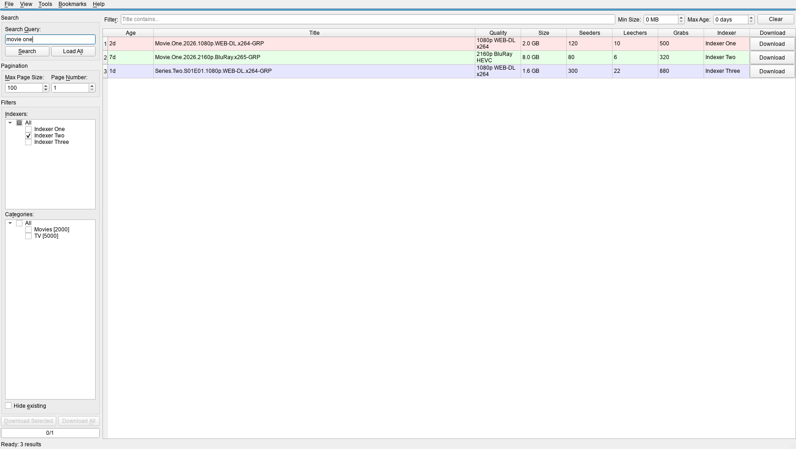
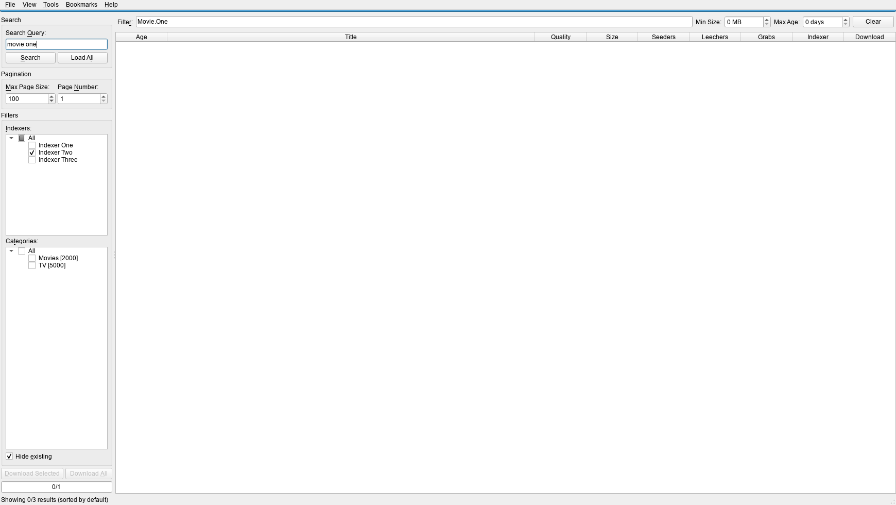
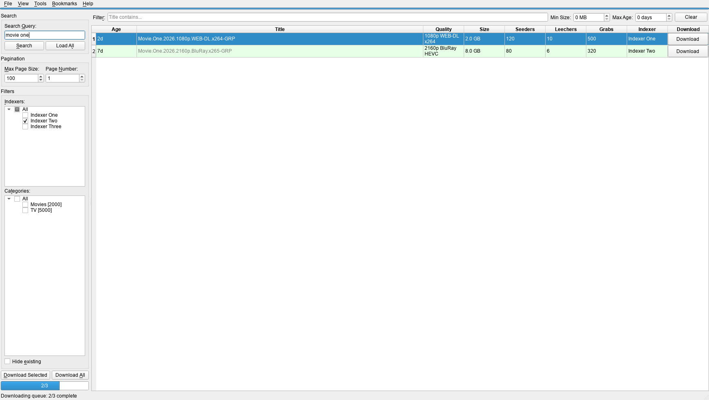

# Prowlarr Search Client

A Windows desktop application for searching [Prowlarr](https://prowlarr.com/) indexers with [Everything](https://www.voidtools.com/) integration for duplicate detection and batch downloads.

Built with PySide6 (Qt for Python).

## Table of Contents

- [Features](#features)
- [UI Walkthrough](#ui-walkthrough)
- [Requirements](#requirements)
- [Installation](#installation)
- [Usage](#usage)
- [Configuration](#configuration)
- [Everything Integration](#everything-integration)
- [Keyboard Shortcuts](#keyboard-shortcuts)
- [Menus](#menus)
- [Project Structure](#project-structure)
- [Architecture](#architecture)
- [Development](#development)
- [Troubleshooting](#troubleshooting)
- [Legal Disclaimer](#legal-disclaimer)

## Features

- **Multi-indexer search** - query all your Prowlarr indexers at once, filter by indexer and category
- **Duplicate detection** - automatically checks results against [Everything](https://www.voidtools.com/) to find files you already have on disk
- **Batch downloads** - download individual results, selected rows, or everything visible with one click
- **Bookmarks** - save frequently used search queries for quick access
- **Quality parsing** - displays resolution, source, codec, and HDR info extracted from release titles
- **Keyboard-driven** - full keyboard navigation with single-key shortcuts for common actions
- **Custom commands** - bind F2/F3/F4 to your own scripts with `{title}` and `{video}` placeholders
- **Paginated results** - navigate through large result sets page by page or load all pages at once

## UI Walkthrough

1. Configure query, indexers, and categories, then review result quality.

   

   Overview state with search controls, grouped results, and key quality columns.

2. Filter duplicates and verify already-on-disk matches.

   

   Workflow state with Everything-marked rows for safe duplicate-aware selection.

3. Execute download actions from a focused queue.

   

   Action-focused state for selecting rows and triggering downloads confidently.

## Requirements

- **Windows** (10 or later)
- **Python 3.10+**
- **Prowlarr** instance with API access
- **Everything** (optional) - for duplicate detection via SDK or HTTP server

## Installation

### First-time Setup

```bat
python scripts\windows\setup_env.py
```

Creates the `.venv` by running `uv sync --locked` (falls back to `uv sync` if no lockfile).

Manual alternative for development:

```bat
uv sync --group dev
```

On first launch, a setup wizard prompts for your Prowlarr host and API credentials (API key in Prowlarr under *Settings > General*).

## Usage

### Recommended (console-less)

```bat
pyw scripts\windows\run_app_gui.pyw
```

Launches the GUI without a console window. Auto-bootstraps the `.venv` via `setup_env.py` if not yet created.

### With console

```bat
python scripts\windows\run_app.py
```

Runs via `hatch run python -m prowlarr_ui`. Requires `hatch` in PATH.

### Direct

```bat
python -m prowlarr_ui
:: or, after installation:
prowlarr-ui
```

### Quick Start

1. Enter a search query and press **Enter**
2. Select indexers and categories from the tree views on the left
3. Results appear in the center table, color-grouped by title
4. Press **Space** to download a result and advance to the next row
5. Gray rows = already on disk (detected by Everything)

## Configuration

Runtime config and UI preferences share one QSettings INI store:

- Backend: `QSettings(IniFormat, UserScope, "ThreepSoftwz", "prowlarr_ui")`
- Default INI path: `%APPDATA%\ThreepSoftwz\prowlarr_ui.ini`
- Default non-INI data path (logs, download history, SDK cache): `%LOCALAPPDATA%\ThreepSoftwz\prowlarr_ui\`
- OV01 env overrides:
  - `CONFIG_DIR` overrides the QSettings INI root
  - `DATA_DIR` overrides the non-INI data root
- Secrets are still stored in the same config store (plaintext) and can be overridden by env vars:
  - `PROWLARR_UI_API_KEY`
  - `PROWLARR_UI_HTTP_BASIC_AUTH_PASSWORD`

### Key Settings

| Setting | Default | Description |
|---|---|---|
| `everything_integration_method` | `"sdk"` | `"sdk"`, `"http"`, or `"none"` |
| `title_match_chars` | `42` | Characters used for title grouping and color coding |
| `everything_search_chars` | `42` | Characters used for Everything prefix search |
| `web_search_url` | `"https://...google..."` | URL template with `{query}` placeholder |
| `api_timeout` | `300` | API request timeout in seconds |
| `api_retries` | `2` | Retry attempts on connection errors / 5xx |
| `prowlarr_page_size` | `100` | Results per page from Prowlarr API |
| `everything_recheck_delay` | `6000` | Delay (ms) before rechecking Everything after download |
| `everything_max_results` | `5` | Max Everything matches shown in tooltip |
| `everything_batch_size` | `10` | Results per UI update batch during Everything check |

### Custom Commands

Bind scripts to F2, F3, F4 in runtime settings:

```ini
custom_command_F2 = 'my_script.bat "{title}" "{video}"'
custom_command_F3 = 'explorer /select,"{video}"'
custom_command_F4 = 'notepad "{title}"'
```

Placeholders: `{title}` = release title, `{video}` = video file path from Everything (empty if not found).

### Preferences

Persistent keys are namespaced:

- `config/...` for service/runtime config
- `prefs/...` for non-visual user preferences (history, bookmarks, selected filters)
- `ui/...` for view state (splitter, hidden columns, column widths, toggles)

## Everything Integration

[Everything](https://www.voidtools.com/) is a Windows file search engine. This app uses it to detect which releases you already have on disk.

**SDK mode** (default): The app auto-downloads `Everything64.dll` from voidtools on first run. Requires Everything to be running.

**HTTP mode**: Uses Everything's built-in HTTP server. Enable it in Everything: *Tools > Options > HTTP Server*.

**None**: Disable Everything integration entirely if you don't need duplicate detection.

## Keyboard Shortcuts

These work when the results table is focused:

| Key | Action |
|---|---|
| **Space** | Download current row, advance to next |
| **S** | Launch Everything search for the title |
| **C** | Copy release title to clipboard |
| **G** | Open web search for the title |
| **P** | Play video file found by Everything |
| **Tab** | Jump to next title group |
| **Shift+Tab** | Jump to previous title group |
| **Ctrl+A** | Select all visible rows |
| **Ctrl+F** | Find in table |
| **F1** | Show help |
| **F2 / F3 / F4** | Run custom commands (configurable) |

## Menus

**File** - Exit the application (Ctrl+Q, Alt+X).

**View**:
- **Show Log** - Open the log window to view application messages
- **Download History** - View the log of previously downloaded items
- **Select Best per Group** - Highlight the best result in each title group (by seeders, fallback to size)
- **Reset Sorting** - Restore default sort order (Title ASC, Indexer DESC, Age ASC)
- **Fit Columns** - Resize visible columns to fit their contents
- **Reset View** - Reset column widths, splitter position, and sort order to defaults

**Bookmarks** - Save and recall frequently used search queries:
- **Add Bookmark** - Save the current search query
- **Delete Bookmark** - Remove a saved bookmark
- **Sort Bookmarks** - Sort all bookmarks alphabetically
- Saved bookmarks appear as individual menu items for one-click re-search

**Tools** - Edit .ini File (opens the QSettings INI in your default editor).

**Help** - Show the in-app help dialog (F1).

## Project Structure

```text
prowlarr-ui/
|-- pyproject.toml
|-- uv.lock
|-- src/
|   `-- prowlarr_ui/
|       |-- __main__.py                    # Module entrypoint for python -m prowlarr_ui
|       |-- app.py                         # Main entry point and UI (MainWindow)
|       |-- api/
|       |   |-- prowlarr_client.py         # Prowlarr REST API client
|       |   `-- everything_search.py       # Everything SDK/HTTP integration
|       |-- workers/
|       |   |-- search_worker.py           # Background search thread
|       |   |-- everything_worker.py       # Background Everything check thread
|       |   `-- download_worker.py         # Download queue processor
|       |-- ui/
|       |   |-- widgets.py                 # Custom table widget for numeric sorting
|       |   |-- log_window.py              # Detachable log viewer window
|       |   `-- help_text.py               # Help dialog content
|       `-- utils/
|           |-- config.py                  # Typed QSettings config load/save
|           |-- formatters.py              # Size and age formatting utilities
|           |-- logging_config.py          # Rotating file log setup
|           `-- quality_parser.py          # Resolution/source/codec extraction from titles
|-- scripts/
|   `-- windows/
|       |-- setup_env.py                   # Create/verify .venv via uv sync
|       |-- run_app.py                     # Launch app via hatch run
|       |-- run_app_gui.pyw                # Launch GUI without console window
|       `-- run_tests.py                   # Run tests via hatch run test
|-- docs/
|   `-- architecture.md                    # Threading and ownership model
|-- tests/
|   |-- unit/                              # Unit/regression tests
|   |-- ui/                                # pytest-qt UI tests
|   `-- integration/                       # Live/manual integration checks
|       `-- test_integrations.py           # Prowlarr + Everything connectivity script
`-- CONTRIBUTING.md                        # Contribution and tooling workflow
```

## Architecture

- `src/` layout with `prowlarr_ui` package.
- `MainWindow` (`app.py`) is the composition root.
- Background operations use dedicated worker threads (`QThread`-based):
  - `search_worker` — Prowlarr API search.
  - `everything_worker` — Everything SDK/HTTP duplicate checks.
  - `download_worker` — Download queue processor.
- `api/` contains external service integrations (Prowlarr REST, Everything SDK/HTTP).
- `utils/` contains config management, formatting, logging, and quality parsing.
- Rotating file-based logging via `logging_config.py`.

### Packaging and Entrypoints

- Build backend: **Hatchling** (`pyproject.toml`)
- Canonical package/import path: `prowlarr_ui`
- Dependency source of truth: `pyproject.toml`
- Resolver/installer backend: **uv**
- Lockfile: `uv.lock`
- Run commands:
  - `python -m prowlarr_ui`
  - `prowlarr-ui` (installed console script)

### Dependencies

| Package | Purpose |
|---|---|
| PySide6 >= 6.5.0 | Qt GUI framework |
| requests >= 2.31.0 | HTTP client for Prowlarr API |
| colorama >= 0.4.6 | Colored test output |

## Development

### Windows Helpers

| Script | Description |
|---|---|
| `python scripts\windows\setup_env.py` | Create/verify `.venv` via `uv sync --locked` |
| `pyw scripts\windows\run_app_gui.pyw` | Launch GUI without console window (auto-bootstraps venv) |
| `python scripts\windows\run_app.py` | Launch app via `hatch run` (requires hatch in PATH) |
| `python scripts\windows\run_tests.py` | Run test suite via `hatch run test` |

### Testing

Run the integration tests to verify your Prowlarr and Everything connections:

```bat
python tests\integration\test_integrations.py
```

Run the automated headless UI tests (mocked, no live Prowlarr/Everything required):

```bat
hatch run test
```

### Quality Checks

Run CI-equivalent quality gates locally:

```bat
hatch run lint
hatch run format-check
hatch run typecheck
hatch run cov
hatch run audit
hatch run audit-clean
hatch run package
```

### Lockfile Workflow

```bat
uv lock
uv lock --check
```

## Troubleshooting

### Prowlarr connection errors

- Verify the URL includes `http://` or `https://`
- Verify the API key is valid (Prowlarr > Settings > General > API Key)
- Confirm Prowlarr is reachable from this machine

### Everything not detecting files

- Ensure Everything is running (SDK mode requires the Everything process)
- For HTTP mode, enable the HTTP server in Everything: *Tools > Options > HTTP Server*
- Check `everything_integration_method` in settings (`"sdk"`, `"http"`, or `"none"`)

### Config issues

- On first run, the setup wizard should prompt for credentials
- Use *Tools > Edit .ini File* to manually edit the config

---

<!-- legal-disclaimer:start -->
## Legal Disclaimer

THIS SOFTWARE IS PROVIDED "AS IS" AND "AS AVAILABLE," WITHOUT WARRANTIES OF ANY KIND, WHETHER EXPRESS, IMPLIED, STATUTORY, OR OTHERWISE, INCLUDING, WITHOUT LIMITATION, ANY IMPLIED WARRANTIES OF MERCHANTABILITY, FITNESS FOR A PARTICULAR PURPOSE, TITLE, NON-INFRINGEMENT, ACCURACY, OR QUIET ENJOYMENT. TO THE MAXIMUM EXTENT PERMITTED BY APPLICABLE LAW, THE AUTHORS, CONTRIBUTORS, MAINTAINERS, DISTRIBUTORS, AND AFFILIATED PARTIES SHALL NOT BE LIABLE FOR ANY DIRECT, INDIRECT, INCIDENTAL, SPECIAL, CONSEQUENTIAL, EXEMPLARY, OR PUNITIVE DAMAGES, OR FOR ANY LOSS OF DATA, PROFITS, GOODWILL, BUSINESS OPPORTUNITY, OR SERVICE INTERRUPTION, ARISING OUT OF OR RELATING TO THE USE OF, OR INABILITY TO USE, THIS SOFTWARE, EVEN IF ADVISED OF THE POSSIBILITY OF SUCH DAMAGES. THIS SOFTWARE HAS BEEN DEVELOPED, IN WHOLE OR IN PART, BY "INTELLIGENT TOOLS"; ACCORDINGLY, OUTPUTS MAY CONTAIN ERRORS OR OMISSIONS, AND YOU ASSUME FULL RESPONSIBILITY FOR INDEPENDENT VALIDATION, TESTING, LEGAL COMPLIANCE, AND SAFE OPERATION PRIOR TO ANY RELIANCE OR DEPLOYMENT.
<!-- legal-disclaimer:end -->
