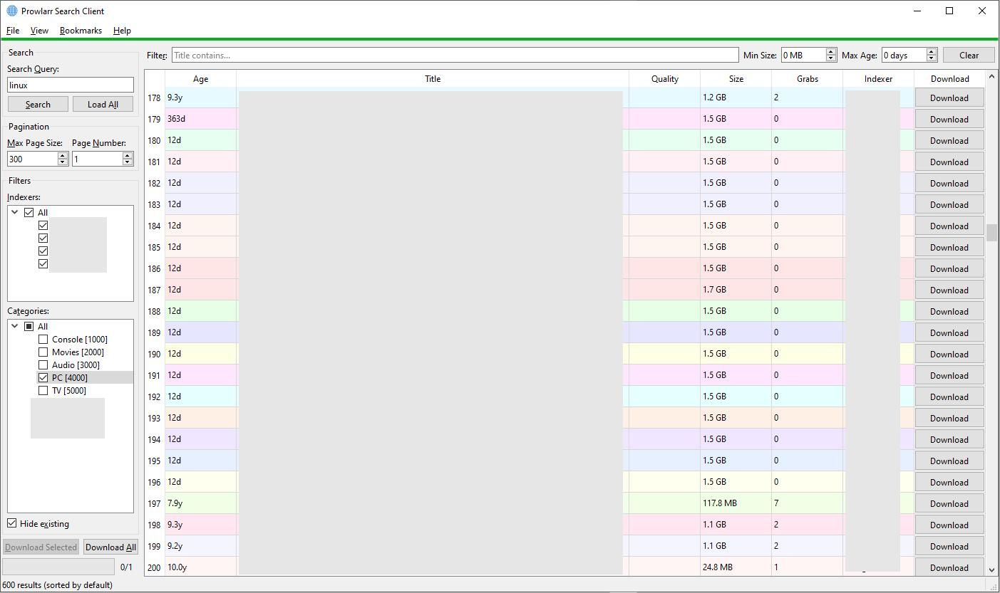

# Prowlarr Search Client

A Windows desktop application for searching [Prowlarr](https://prowlarr.com/) indexers with [Everything](https://www.voidtools.com/) integration for duplicate detection and batch downloads.

Built with PySide6 (Qt for Python).


## Features

- **Multi-indexer search** - query all your Prowlarr indexers at once, filter by indexer and category
- **Duplicate detection** - automatically checks results against [Everything](https://www.voidtools.com/) to find files you already have on disk
- **Batch downloads** - download individual results, selected rows, or everything visible with one click
- **Bookmarks** - save frequently used search queries for quick access
- **Quality parsing** - displays resolution, source, codec, and HDR info extracted from release titles
- **Keyboard-driven** - full keyboard navigation with single-key shortcuts for common actions
- **Custom commands** - bind F2/F3/F4 to your own scripts with `{title}` and `{video}` placeholders
- **Paginated results** - navigate through large result sets page by page or load all pages at once

## Screenshot



*Left panel with search controls and filters, center results table with color-coded title grouping, and a detachable log window.*

## Requirements

- **Windows** (10 or later)
- **Python 3.10+**
- **Prowlarr** instance with API access
- **Everything** (optional) - for duplicate detection via SDK or HTTP server

## Installation

1. Clone the repository and install tooling.

Bootstrap:

```bash
uv tool install hatch
```

Sync lockfile:

```bash
uv lock
```

2. Copy the example config and add your Prowlarr credentials:

```bash
cp config/app.example.toml config/app.local.toml
```

3. Edit `config/app.local.toml` with your Prowlarr API key (found in Prowlarr under *Settings > General*):

```toml
[prowlarr]
host = "http://localhost:9696"
api_key = "YOUR_API_KEY_HERE"
# http_basic_auth_username = ""
# http_basic_auth_password = ""
```

## Usage

```bash
python -m prowlarr_ui
# or, after installation:
prowlarr-ui
```

### Quick Start

1. Enter a search query and press **Enter**
2. Select indexers and categories from the tree views on the left
3. Results appear in the center table, color-grouped by title
4. Press **Space** to download a result and advance to the next row
5. Gray rows = already on disk (detected by Everything)

### Keyboard Shortcuts

These work when the results table is focused:

| Key | Action |
|---|---|
| **Space** | Download current row, advance to next |
| **S** | Launch Everything search for the title |
| **C** | Copy release title to clipboard |
| **G** | Open web search for the title |
| **P** | Play video file found by Everything |
| **Tab** | Jump to next title group |
| **Shift+Tab** | Jump to previous title group |
| **Ctrl+A** | Select all visible rows |
| **Ctrl+F** | Find in table |
| **F1** | Show help |
| **F2 / F3 / F4** | Run custom commands (configurable) |

### Menus

**File** - Exit the application (Alt+X).

**View**:
- **Show Log** - Open the log window to view application messages
- **Download History** - View the log of previously downloaded items
- **Select Best per Group** - Highlight the best result in each title group (by seeders, fallback to size)
- **Reset Sorting** - Restore default sort order (Title ASC, Indexer DESC, Age ASC)
- **Reset View** - Reset column widths, splitter position, and sort order to defaults

**Bookmarks** - Save and recall frequently used search queries:
- **Add Bookmark** - Save the current search query
- **Delete Bookmark** - Remove a saved bookmark
- **Sort Bookmarks** - Sort all bookmarks alphabetically
- Saved bookmarks appear as individual menu items for one-click re-search

**Help** - Show the in-app help dialog (F1).

## Configuration

All settings use this contract:

- `config/app.defaults.toml` (tracked defaults)
- `config/app.example.toml` (tracked template)
- `config/app.local.toml` (untracked local overrides)

Secrets can live outside the repo in:

- `%APPDATA%/prowlarr-ui/secrets.toml` (Windows)
- `~/.config/prowlarr-ui/secrets.toml` (Linux/macOS)

Optional global path overrides:

- `APP_CONFIG_PATH`
- `APP_SECRETS_PATH`

### Key Settings

| Setting | Default | Description |
|---|---|---|
| `everything_integration_method` | `"sdk"` | `"sdk"`, `"http"`, or `"none"` |
| `title_match_chars` | `42` | Characters used for title grouping and color coding |
| `everything_search_chars` | `42` | Characters used for Everything prefix search |
| `web_search_url` | `"https://...google..."` | URL template with `{query}` placeholder |
| `api_timeout` | `300` | API request timeout in seconds |
| `api_retries` | `2` | Retry attempts on connection errors / 5xx |
| `prowlarr_page_size` | `100` | Results per page from Prowlarr API |
| `everything_recheck_delay` | `6000` | Delay (ms) before rechecking Everything after download |
| `everything_max_results` | `5` | Max Everything matches shown in tooltip |
| `everything_batch_size` | `10` | Results per UI update batch during Everything check |

### Custom Commands

Bind scripts to F2, F3, F4 in the `[settings]` section:

```toml
custom_command_F2 = 'my_script.bat "{title}" "{video}"'
custom_command_F3 = 'explorer /select,"{video}"'
custom_command_F4 = 'notepad "{title}"'
```

Placeholders: `{title}` = release title, `{video}` = video file path from Everything (empty if not found).

### Preferences

The `[preferences]` section is auto-saved on exit and includes search history, selected indexers/categories, splitter position, column widths, and bookmarks. You generally don't need to edit this manually.

## Everything Integration

[Everything](https://www.voidtools.com/) is a Windows file search engine. This app uses it to detect which releases you already have on disk.

**SDK mode** (default): The app auto-downloads `Everything64.dll` from voidtools on first run. Requires Everything to be running.

**HTTP mode**: Uses Everything's built-in HTTP server. Enable it in Everything: *Tools > Options > HTTP Server*.

**None**: Disable Everything integration entirely if you don't need duplicate detection.

## Project Structure

```
src/
  prowlarr_ui/
    __main__.py                    Module entrypoint for `python -m prowlarr_ui`
    app.py                         Main entry point and UI (MainWindow)
    api/
      prowlarr_client.py           Prowlarr REST API client
      everything_search.py         Everything SDK/HTTP integration
    workers/
      search_worker.py             Background search thread
      everything_worker.py         Background Everything check thread
      download_worker.py           Download queue processor
    ui/
      widgets.py                   Custom table widget for numeric sorting
      log_window.py                Detachable log viewer window
      help_text.py                 Help dialog content
    utils/
      config.py                    TOML config load/save with atomic writes
      formatters.py                Size and age formatting utilities
      logging_config.py            Rotating file log setup
      quality_parser.py            Resolution/source/codec extraction from titles
scripts/
  windows/
    run_app.py                     Standard app launcher (python -m prowlarr_ui)
    run_app_gui.pyw                 Standard GUI launcher
    run_tests.py                   Standard test runner
docs/
  architecture.md                  Threading and ownership model
tests/
  unit/                            Unit/regression tests
  ui/                              pytest-qt UI tests
  integration/                     Live/manual integration checks
    test_integrations.py           Prowlarr + Everything connectivity script
config/app.example.toml            Configuration template
CONTRIBUTING.md                    Contribution and tooling workflow
```

## Packaging and Entrypoints

- Build backend: **Hatchling** (`pyproject.toml`)
- Canonical package/import path: `prowlarr_ui`
- Dependency source of truth: `pyproject.toml`
- Resolver/installer backend: **uv**
- Lockfile: `uv.lock` (only)
- Run commands:
  - `python -m prowlarr_ui`
  - `prowlarr-ui` (installed console script)

Lockfile workflow:

```bash
uv lock
uv lock --check
```

## Testing

Run the integration tests to verify your Prowlarr and Everything connections:

```bash
python tests/integration/test_integrations.py
```

Run the automated headless UI tests (mocked, no live Prowlarr/Everything required):

```bash
hatch run test
```

Run CI-equivalent quality gates locally:

```bash
hatch run lint
hatch run format-check
hatch run typecheck
hatch run cov
hatch run audit
hatch run audit-clean
hatch run package
```

## Dependencies

| Package | Purpose |
|---|---|
| PySide6 >= 6.5.0 | Qt GUI framework |
| requests >= 2.31.0 | HTTP client for Prowlarr API |
| tomlkit >= 0.12.0 | TOML config with comment preservation |
| colorama >= 0.4.6 | Colored test output |


---

---

<!-- legal-disclaimer:start -->
## Legal Disclaimer

THIS SOFTWARE IS PROVIDED "AS IS" AND "AS AVAILABLE," WITHOUT WARRANTIES OF ANY KIND, WHETHER EXPRESS, IMPLIED, STATUTORY, OR OTHERWISE, INCLUDING, WITHOUT LIMITATION, ANY IMPLIED WARRANTIES OF MERCHANTABILITY, FITNESS FOR A PARTICULAR PURPOSE, TITLE, NON-INFRINGEMENT, ACCURACY, OR QUIET ENJOYMENT. TO THE MAXIMUM EXTENT PERMITTED BY APPLICABLE LAW, THE AUTHORS, CONTRIBUTORS, MAINTAINERS, DISTRIBUTORS, AND AFFILIATED PARTIES SHALL NOT BE LIABLE FOR ANY DIRECT, INDIRECT, INCIDENTAL, SPECIAL, CONSEQUENTIAL, EXEMPLARY, OR PUNITIVE DAMAGES, OR FOR ANY LOSS OF DATA, PROFITS, GOODWILL, BUSINESS OPPORTUNITY, OR SERVICE INTERRUPTION, ARISING OUT OF OR RELATING TO THE USE OF, OR INABILITY TO USE, THIS SOFTWARE, EVEN IF ADVISED OF THE POSSIBILITY OF SUCH DAMAGES. THIS SOFTWARE HAS BEEN DEVELOPED, IN WHOLE OR IN PART, BY "INTELLIGENT TOOLS"; ACCORDINGLY, OUTPUTS MAY CONTAIN ERRORS OR OMISSIONS, AND YOU ASSUME FULL RESPONSIBILITY FOR INDEPENDENT VALIDATION, TESTING, LEGAL COMPLIANCE, AND SAFE OPERATION PRIOR TO ANY RELIANCE OR DEPLOYMENT.
<!-- legal-disclaimer:end -->
